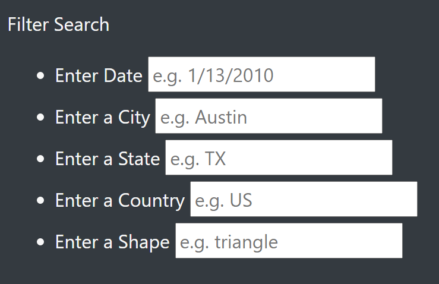

# UFOs

## Project Overview

The purpose of this analysis was to use JavaScript, HTML, and CSS to create a clean webpage that displays and filters UFO sighting data at the user's command.

## Results

The webpage features the ability to filter the UFO sighting data using 5 different attributes: date, city, state, country, and UFO shape. When an attribute is entered (for example, "TX" for state) the table will automatically update itself to only show UFO sightings that took place in Texas.

## Summary

One drawback of this design is that some users may prefer the use of a filter button that performs all filters at once as opposed to individually. A recommendation for futher development would be to replace the "Date" filter with "Start Date" and "End Date" filters that would allow users to filter through a range of dates. Another recommendation for further development would be to have the table show "No data available with selected filters" so it is more clear to the user that data was unavailable and it was not in fact the table glitching and showing no rows.
